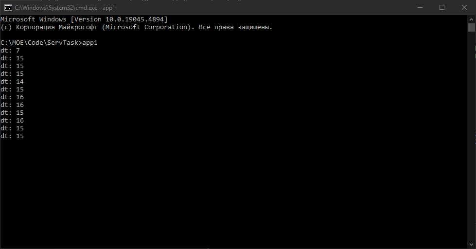

# Техническое задание
Реализовать 2 приложения, которые обмениваются синхросигналами через шину данных (брокер сообщений NATS JetStream):
- приложение 1 записывает тик времени в основном потоке раз в 10 мс и асинхронно передает в шину данных
- приложение 2 считывает из шины данных и выводит в консоль dt, где "dt=t_real- t_sign", где t_real - UNIXTIME время приема сообщения в сек.мс (округление до мс), t_sign - время в теле сообщения
- приложение 2 аналогично асинхронно отправляет свой тик времени в приложение 1, которое в свою очередь выводит в консоль dt.

## В разработке использовались
- Язык `C++`
- Брокер сообщений `NATS JetStream`
- Docker

## Установка

Установка стороннего ПО для проекта: 
- [**NATS**](https://docs.nats.io/running-a-nats-service/introduction/installation) -брокер сообщений, используемый для обмена данными между приложениями.

- [**OpenSSL**](https://wiki.openssl.org/index.php/Binaries) - библиотека для работы с SSL/TLS.
- [**MinGW**](https://www.mingw-w64.org/downloads/) - набор инструментов для разработки программного обеспечения.
- [**nats-server**](https://github.com/nats-io/nats-server/releases/?ysclid=m1iaiz9tdp658513633) - сервер NATS, используемый для обмена данными между приложениями.
- [**vcpkg**](https://github.com/microsoft/vcpkg) - менеджер пакетов для C++

Открываем **PowerShell** или **Командную строку** и выполняем команду:

```bash
 git clone https://github.com/microsoft/vcpkg.git
 ```

 Переходим в папку **vcpkg** и выполняем скрипт **bootstrap** для сборки исполняемого файла vcpkg:

```bash
cd vcpkg
.\bootstrap-vcpkg.bat
 ```

В папке **vcpkg** выполняем следущую команду:
```bash
vcpkg install cnats
 ```

## Запуск проекта

**Запуск сервера NATS**

Для запуска сервера NATS необходимо выполнить команду:

```bash
nats-server
 ```

Качаем репозиторий

```bash
git clone https://github.com/Karver719/Task_Server_C.git
 ```

Для сборки приложений в папке проекта выполнить команду

```bash
g++ -o app1 app1.cpp -I<Ваш путь>vcpkg\packages\cnats_x64-windows\include -L<Ваш путь>vcpkg\packages\cnats_x64-windows\lib -lnats
 ```
```bash
g++ -o app2 app2.cpp -I<Путь к vcpkg>vcpkg\packages\cnats_x64-windows\include -L<Путь к vcpkg>vcpkg\packages\cnats_x64-windows\lib -lnats
 ```
**Примечание:** ```<Путь к vcpkg>``` - путь к папке vcpkg на вашем компьютере


 Для запуска приложений
 ```bash
app1
 ```
  ```bash
app2
 ```

## Описание приложений

- **app1**: записывает тик времени в основном потоке раз в 10 мс и асинхронно передает в шину данных. Также принимает тик времени от приложения ```app2``` и выводит в консоль ```dt```. 
- **app2**: считывает из шины данных тик времени, отправленный приложением ```app1```, и выводит в консоль ```dt```. Также асинхронно отправляет свой тик времени в приложение ```app1```.

## Дополнительные пояснения


- **Задержка 10 мс:** Из анализа кода мы видим, что лишняя задержка в 5 миллисекунд возникает из-за того, что ```app1``` спит 1 секунду между обработками сообщений, а ```app2``` ждет 10 миллисекунд перед тем, как читать ответное сообщение. Это означает, что ответное сообщение отправляется app1 через 1 секунду после получения сообщения на тему ```time.tick```, а ```app2``` читает его через 10 миллисекунд после отправки. Следовательно, лишняя задержка составляет 5 миллисекунд

- **Параметры подключения к NATS:** По умолчанию приложения подключаются к локальному серверу ```NATS``` на порту 4222. 

- **nats.dll:** Библиотека ```nats.dll``` является частью пакета cnats и должна быть доступна в пути, указанном при компиляции. Если возникают проблемы с загрузкой библиотеки, убедитесь, что путь к ней корректен.


