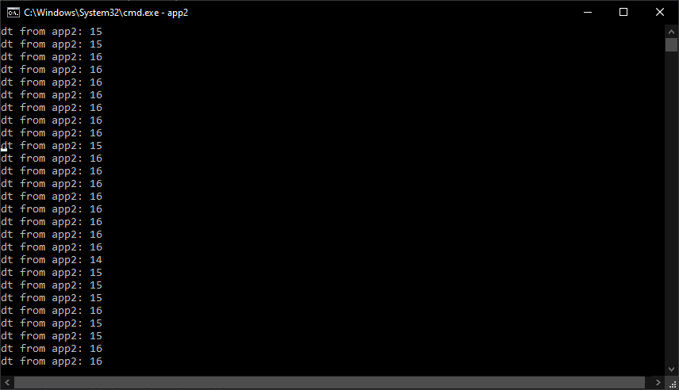

# Техническое задание
Реализовать 2 приложения, которые обмениваются синхросигналами через шину данных (брокер сообщений NATS JetStream):
- приложение 1 записывает тик времени в основном потоке раз в 10 мс и асинхронно передает в шину данных
- приложение 2 считывает из шины данных и выводит в консоль dt, где "dt=t_real- t_sign", где t_real - UNIXTIME время приема сообщения в сек.мс (округление до мс), t_sign - время в теле сообщения
- приложение 2 аналогично асинхронно отправляет свой тик времени в приложение 1, которое в свою очередь выводит в консоль dt.

## В разработке использовались
- Язык `C++`
- Брокер сообщений `NATS JetStream`
- Docker

## Установка

Установка стороннего ПО для проекта: [**NATS**](https://docs.nats.io/running-a-nats-service/introduction/installation)

- [**OpenSSL**](https://wiki.openssl.org/index.php/Binaries)
- [**MinGW**](https://www.mingw-w64.org/downloads/)
- [**nats-server**](https://github.com/nats-io/nats-server/releases/?ysclid=m1iaiz9tdp658513633)
- vcpkg

Открываем **PowerShell** или **Командную строку** и выполняем команду:

```bash
 git clone https://github.com/microsoft/vcpkg.git
 ```

 Переходим в папку **vcpkg** и выполняем скрипт **bootstrap** для сборки исполняемого файла vcpkg:

```bash
cd vcpkg
.\bootstrap-vcpkg.bat
 ```

В папке **vcpkg** выполняем следущую команду:
```bash
vcpkg install cnats
 ```

## Запуск проекта

Качаем репозиторий

```bash
git clone https://github.com/Karver719/Task_Server_C.git
 ```

Для сборки приложений в папке проекта выполнить команду

```bash
g++ -o app1 app1.cpp -I<Ваш путь>vcpkg\packages\cnats_x64-windows\include -L<Ваш путь>vcpkg\packages\cnats_x64-windows\lib -lnats
 ```
```bash
g++ -o app2 app2.cpp -I<Ваш путь>vcpkg\packages\cnats_x64-windows\include -L<Ваш путь>vcpkg\packages\cnats_x64-windows\lib -lnats
 ```
 Для запуска приложений
 ```bash
app1
 ```
  ```bash
app2
 ```


